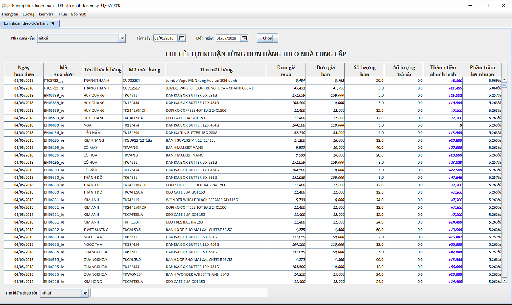
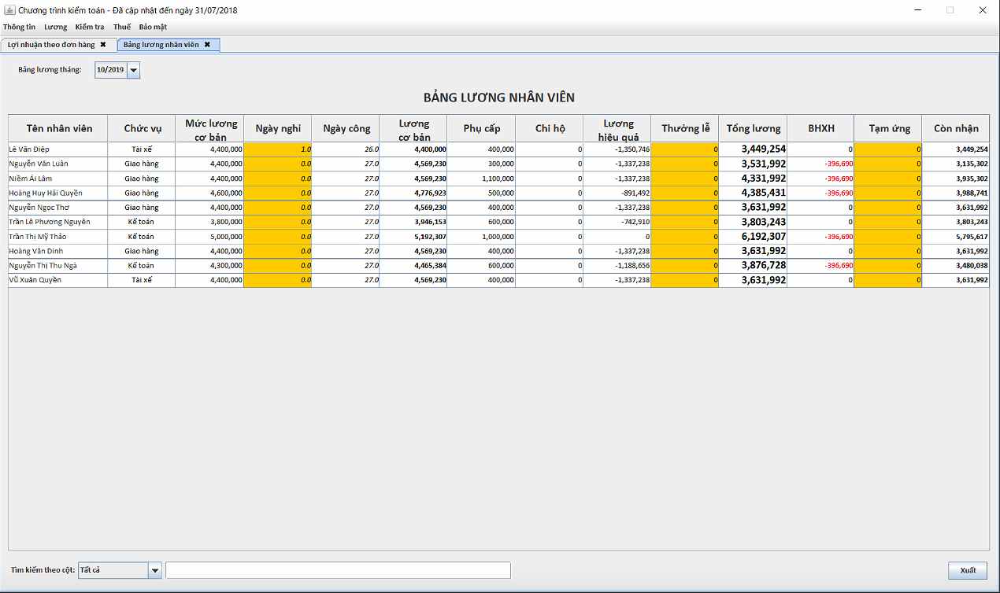

# CTKT - A Java-GUI Accounting program

The project aims at designing a medium-sized GUI program that accommodates various functionalities of managing profits and resources for [a small-sized company](http://www.thongtincongty.com/company/133832914-cong-ty-tnhh-xuan-anh-khanh-hoa/). 

The program uses [Apache Derby](https://db.apache.org/derby/) - a relational database management system to track the company's inventory and liabilities as well as daily trading records.

This program is used to complement the missing functionalities of [MISA](http://www.misa.com.vn/) in reporting gross profits, liabilities.

It also allows for **file extraction** and **file export** (in Excel) to represent statistical data that summarizes the monthly profits, liabilities and inventories of the company

##### Example usage:

There is also an additional functionality which tracks the staff's monthly salaries.

##### Example usage:

